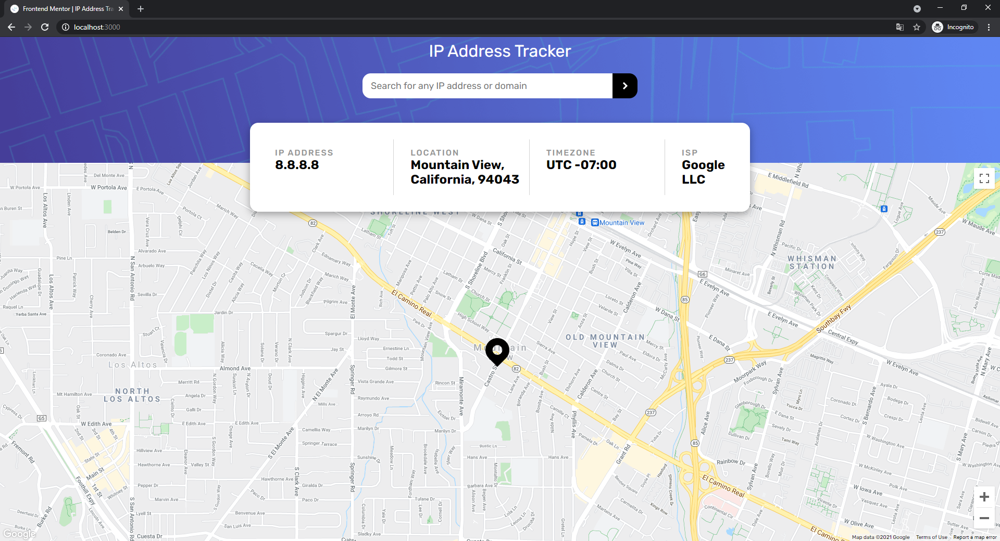

# Frontend Mentor - IP address tracker solution

This is a solution to the [IP address tracker challenge on Frontend Mentor](https://www.frontendmentor.io/challenges/ip-address-tracker-I8-0yYAH0). Frontend Mentor challenges help you improve your coding skills by building realistic projects. 

## Table of contents

- [Overview](#overview)
  - [The challenge](#the-challenge)
  - [Screenshot](#screenshot)
  - [Links](#links)
  - [Built with](#built-with)

### The challenge

Users should be able to:

- View the optimal layout for each page depending on their device's screen size
- See hover states for all interactive elements on the page
- See their own IP address on the map on the initial page load
- Search for any IP addresses or domains and see the key information and location

### Screenshot

### Links

- Solution URL: [Add solution URL here](https://your-solution-url.com)
- Live Site URL: [Add live site URL here](https://your-live-site-url.com)

### Built with

- Semantic HTML5 markup
- CSS custom properties
- Flexbox
- [React](https://reactjs.org/) - JS library

### Style Guide

#### Layout

The designs were created to the following widths:

- Mobile: 375px
- Desktop: 1440px

#### Colors

- Very Dark Gray: hsl(0, 0%, 17%)
- Dark Gray: hsl(0, 0%, 59%)

#### Typography

#### Body Copy

- Font size (text input): 18px

#### Font

- Family: [Rubik](https://fonts.google.com/specimen/Rubik)
- Weights: 400, 500, 700

